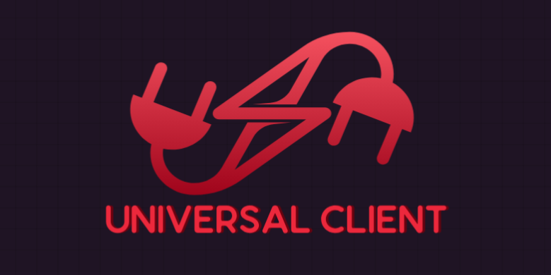

#  Universal-Client

**A TypeScript‑first, plugin‑driven library for seamless, configuration‑driven communication with multi-protocol services — optimized for modern service architectures and high‑performance apps.**

